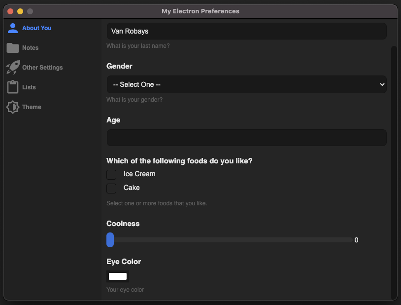
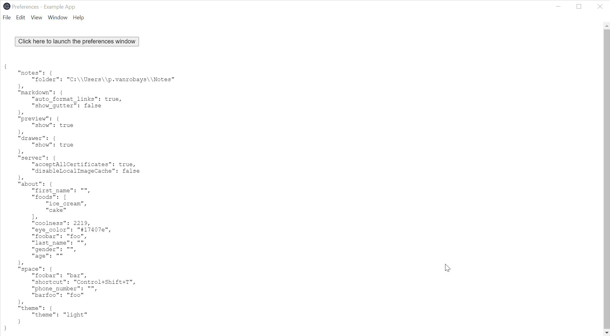
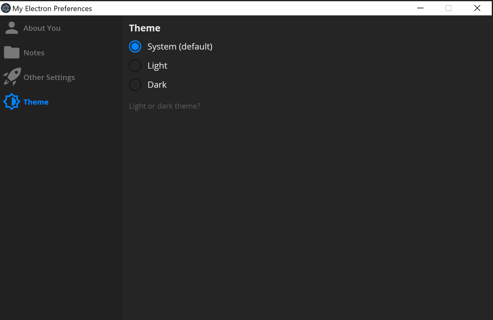
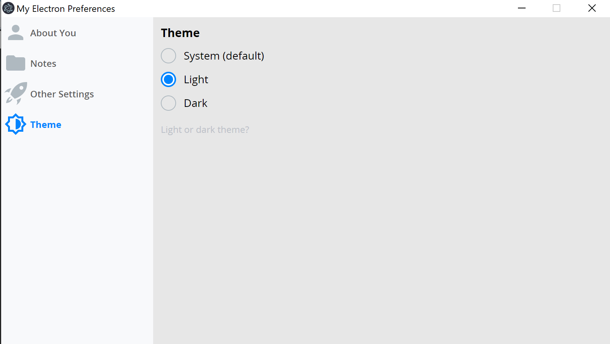

# Electron Preferences

> An Electron store with built-in preferences management



- [Electron Preferences](#electron-preferences)
  - [Introduction](#introduction)
  - [Features](#features)
    - [Field Types](#field-types)
  - [Demo](#demo)
  - [Getting Started](#getting-started)
  - [From the Main process](#from-the-main-process)
  - [From the Renderer process](#from-the-renderer-process)
  - [Customization](#customization)
  - [Icons](#icons)
  - [Example Code](#example-preferences-code)

## Introduction

This package provides [Electron](https://electronjs.org/) developers with a simple, consistent interface for managing user preferences. It includes two primary components:

- A simple key/value store API for interacting with the service.
- A GUI interface allowing users to manage preference values in the frontend of your application.

## Features

- A drop-in Electron key/value store
- Built-in preference manager
- Icons for preference groups
- Default values
- Hidden values
- Color Picker and Accelerator input for keyboard shortcuts
- Easily read / write values via the built-in API
- Components are written in React, adding new inputs is straightforward
- Uses write-json-file under the hood
- Customize styles using CSS
- Customize the layout of the preference manager using JSON
- Ability to conditionally show/hide different preferences

#### Field Types

The library includes built-in support for the following field types:

| Preference `type` | Description                                               |
| ----------------- | --------------------------------------------------------- |
| `text`            | `<input type="text"/>`                                    |
| `number`          | `<input type="number"/>`                                  |
| `dropdown`        | `<select>`                                                |
| `radio`           | `<input type="radio"/>`                                   |
| `checkbox`        | `<input type="checkbox"/>`                                |
| `slider`          | `<input type="range"/>`                                   |
| `file`            | `<input type="file"/>`                                    |
| `accelerator`     | Keyboard shortcut input                                   |
| `color`           | Color picker input using simonwep/pickr                   |
| `list`            | Ordered list with create/read/update/delete functionality |
| `button`          | An IPC button to pass simple click events back to the main process |
| `message`         | Read-only HTML panel for displaying information           |

---



## Demo

To see the library in action, clone this repository and see the demo application that is included within the `example` folder:

```sh
$ git clone https://github.com/tkambler/electron-preferences.git
$ cd electron-preferences && npm install
$ npm run build
$ npm run example
```

##### Other helpful scripts

```sh
$ npm run lint
```

## Getting Started

To quickly add `electron-preferences` to your existing Electron app:

```sh
# From your Electron project root...
$ npm install electron-preferences
```

Then import and initialize the preference store.

### From the Main process

Within your application's main process, create a new instance of the `ElectronPreferences` class, as shown below.

For an example usage of the library, check out `example/preferences.js`

```js
const ElectronPreferences = require('electron-preferences');
// import ElectronPreferences from 'electron-preferences'; // ...or if you prefer to use module imports

const preferences = new ElectronPreferences({
	// Override default preference BrowserWindow values
	browserWindowOpts: { /* ... */ },
	
	// Create an optional menu bar
	menu: Menu.buildFromTemplate(/* ... */),
	
	// Provide a custom CSS file, relative to your appPath.
	css: 'preference-styles.css'

	// Preference file path
	dataStore: '~/preferences.json', // defaults to <userData>/preferences.json

	// Preference default values
	defaults: { 
		about: {
			name: 'Albert'
		}
	 },

	// Preference sections visible to the UI
	sections: [
		{
			id: 'about',
			label: 'About You',
			icon: 'single-01', // See the list of available icons below
			form: {
				groups: [
					{
						'label': 'About You', // optional
						'fields': [
							{
								label: 'Name',
								key: 'name',
								type: 'text',
								help: 'What is your name?'
							},
							// ...
						]
					},
					// ...
				]
			}
		},
		// ...
	]
})

// Show the preferences window on demand.
preferences.show();
//or show a specific section by its ID
preferences.show("about");

// Get a value from the preferences data store
const name = preferences.value('about.name');

// Save a value within the preferences data store
preferences.value('about.name', 'Einstein');

// Subscribing to preference changes.
preferences.on('save', (preferences) => {
  console.log(`Preferences were saved.`, JSON.stringify(preferences, null, 4));
});

// Using a button field with `channel: 'reset'`
preferences.on('click', (key) => {
  if (key === 'resetButton') {
    resetApp();
  }
});
```

### From the Renderer process

```js
const { ipcRenderer, remote } = require('electron');

// Fetch the preferences object
const preferences = ipcRenderer.sendSync('getPreferences');

// Display the preferences window
ipcRenderer.send('showPreferences');
// Or show a specific section:
ipcRenderer.send('showPreferences', 'about');

// Listen to the `preferencesUpdated` event to be notified when preferences are changed.
ipcRenderer.on('preferencesUpdated', (e, preferences) => {
	console.log('Preferences were updated', preferences);
});

// Instruct the preferences service to update the preferences object from within the renderer.
ipcRenderer.sendSync('setPreferences', { ... });
```


## Field Properties API
All properties are string value types unless indicated.

##### `key` _(required)_
Identifier for the preference to change. Preferences are referenced using a concatenation of `<section_id>.<field_key>`

##### `label` _(optional)_
Title label for the preference.

##### `help` _(optional)_
Help text to be displayed below the preference.

##### `hideFunction` _(optional)_
A function which provides the current preferences object and returns a boolean whether or not the current field should be hidden in the preferences window.


### Field-specific properties
> _field_ `{ type: "..." }`

### `accelerator`

##### `allowOnlyModifier`
`boolean`
Allow modifier-only shortcuts to be set, like `Alt`

##### `modifierRequired`
`boolean`
Require a modifier (ctrl, alt, shift, meta) to be used in the accelerator shortcut.

### `button`

### `checkbox`

### `color`

### `dropdown`

### `file`

### `list`

### `message`

### `number`

### `radio`

### `slider`

### `text`


## Customization

### Conditional preferences
Sections, groups or fields can be conditionally hidden.
Each one of these entities support the `hideFunction` property. This function has the current preferences as parameter and requires a boolean whether or not this entity should be hidden.

#### Example
````javascript
hideFunction: (preferences) => {
  // hide when sectionsEnabler.group2 preference is false  
  return !preferences.sectionsEnabler?.group2;
}
````

⚠️ Conditional preferences may be available in the preferences, even if they are hidden. It's up to the end user to first check on the hidden expression in case the conditional preference is hidden/shown or enabled/disabled.

### Dark or Light? 🌓

You prefer a dark theme over a light theme? No problem, we have them both. The library will use whatever theme you're using with Electron. See the example on how to add the option to your preferences.




Still not matching your layout? You can easily customize the complete look by injecting your own custom CSS!

### Icons

The following icons come packaged with the library and can be specified when you define the layout of your preferences window.

<table style="width: 100%;">
<thead>
	<tr>
		<th>Name</th>
		<th>Icon</th>
	</tr>
</thead>
<tbody>
	<tr>
		<td>`archive-2`</td>
		<td></td>
	</tr>
	<tr>
		<td>`archive-paper`</td>
		<td></td>
	</tr>
	<tr>
		<td>`award-48`</td>
		<td></td>
	</tr>
	<tr>
		<td>`badge-13`</td>
		<td></td>
	</tr>
	<tr>
		<td>`bag-09`</td>
		<td></td>
	</tr>
	<tr>
		<td>`barcode-qr`</td>
		<td></td>
	</tr>
	<tr>
		<td>`bear-2`</td>
		<td></td>
	</tr>
	<tr>
		<td>`bell-53`</td>
		<td></td>
	</tr>
	<tr>
		<td>`bookmark-2`</td>
		<td></td>
	</tr>
	<tr>
		<td>`brightness-6`</td>
		<td></td>
	</tr>
	<tr>
		<td>`briefcase-24`</td>
		<td></td>
	</tr>
	<tr>
		<td>`calendar-60`</td>
		<td></td>
	</tr>
	<tr>
		<td>`camera-20`</td>
		<td></td>
	</tr>
	<tr>
		<td>`cart-simple`</td>
		<td></td>
	</tr>
	<tr>
		<td>`chat-46`</td>
		<td></td>
	</tr>
	<tr>
		<td>`check-circle-07`</td>
		<td></td>
	</tr>
	<tr>
		<td>`cloud-26`</td>
		<td></td>
	</tr>
	<tr>
		<td>`compass-05`</td>
		<td></td>
	</tr>
	<tr>
		<td>`dashboard-level`</td>
		<td></td>
	</tr>
	<tr>
		<td>`diamond`</td>
		<td></td>
	</tr>
	<tr>
		<td>`edit-78`</td>
		<td></td>
	</tr>
	<tr>
		<td>`email-84`</td>
		<td></td>
	</tr>
	<tr>
		<td>`eye-19`</td>
		<td></td>
	</tr>
	<tr>
		<td>`favourite-31`</td>
		<td></td>
	</tr>
	<tr>
		<td>`flag-points-32`</td>
		<td></td>
	</tr>
	<tr>
		<td>`flash-21`</td>
		<td></td>
	</tr>
	<tr>
		<td>`folder-15`</td>
		<td></td>
	</tr>
	<tr>
		<td>`gift-2`</td>
		<td></td>
	</tr>
	<tr>
		<td>`grid-45`</td>
		<td></td>
	</tr>
	<tr>
		<td>`handout`</td>
		<td></td>
	</tr>
	<tr>
		<td>`heart-2`</td>
		<td></td>
	</tr>
	<tr>
		<td>`home-52`</td>
		<td></td>
	</tr>
	<tr>
		<td>`image`</td>
		<td></td>
	</tr>
	<tr>
		<td>`key-25`</td>
		<td></td>
	</tr>
	<tr>
		<td>`layers-3`</td>
		<td></td>
	</tr>
	<tr>
		<td>`like-2`</td>
		<td></td>
	</tr>
	<tr>
		<td>`link-72`</td>
		<td></td>
	</tr>
	<tr>
		<td>`lock-open`</td>
		<td></td>
	</tr>
	<tr>
		<td>`lock`</td>
		<td></td>
	</tr>
	<tr>
		<td>`multiple-11`</td>
		<td></td>
	</tr>
	<tr>
		<td>`notes`</td>
		<td></td>
	</tr>
	<tr>
		<td>`pencil`</td>
		<td></td>
	</tr>
	<tr>
		<td>`phone-2`</td>
		<td></td>
	</tr>
	<tr>
		<td>`preferences`</td>
		<td></td>
	</tr>
	<tr>
		<td>`send-2`</td>
		<td></td>
	</tr>
	<tr>
		<td>`settings-gear-63`</td>
		<td></td>
	</tr>
	<tr>
		<td>`single-01`</td>
		<td></td>
	</tr>
	<tr>
		<td>`single-folded-content`</td>
		<td></td>
	</tr>
	<tr>
		<td>`skull-2`</td>
		<td></td>
	</tr>
	<tr>
		<td>`spaceship`</td>
		<td></td>
	</tr>
	<tr>
		<td>`square-download`</td>
		<td></td>
	</tr>
	<tr>
		<td>`square-upload`</td>
		<td></td>
	</tr>
	<tr>
		<td>`support-16`</td>
		<td></td>
	</tr>
	<tr>
		<td>`trash-simple`</td>
		<td></td>
	</tr>
	<tr>
		<td>`turtle`</td>
		<td></td>
	</tr>
	<tr>
		<td>`vector`</td>
		<td></td>
	</tr>
	<tr>
		<td>`video-66`</td>
		<td></td>
	</tr>
	<tr>
		<td>`wallet-43`</td>
		<td></td>
	</tr>
	<tr>
		<td>`widget`</td>
		<td></td>
	</tr>
	<tr>
		<td>`world`</td>
		<td></td>
	</tr>
	<tr>
		<td>`zoom-2`</td>
		<td></td>
	</tr>
</tbody>
</table>

## Example preferences code

```js
const electron = require('electron');
const app = electron.app;
const path = require('path');
const os = require('os');
const ElectronPreferences = require('electron-preferences');
// import ElectronPreferences from 'electron-preferences' //Or if you prefer to use module imports

const preferences = new ElectronPreferences({
  /**
   * Where should preferences be saved?
   */
  dataStore: path.resolve(app.getPath('userData'), 'preferences.json'),
  /**
   * Default values.
   */
  defaults: {
    notes: {
      folder: path.resolve(os.homedir(), 'Notes'),
    },
    markdown: {
      auto_format_links: true,
      show_gutter: false,
    },
    preview: {
      show: true,
    },
    drawer: {
      show: true,
    },
  },
  /**
   * The preferences window is divided into sections. Each section has a label, an icon, and one or
   * more fields associated with it. Each section should also be given a unique ID.
   */
  sections: [
    {
      id: 'about',
      label: 'About You',
      /**
       * See the list of available icons below.
       */
      icon: 'single-01',
      form: {
        groups: [
          {
            /**
             * Group heading is optional.
             */
            label: 'About You',
            fields: [
              {
                label: 'First Name',
                key: 'first_name',
                type: 'text',
                /**
                 * Optional text to be displayed beneath the field.
                 */
                help: 'What is your first name?',
              },
              {
                label: 'Last Name',
                key: 'last_name',
                type: 'text',
                help: 'What is your last name?',
              },
              {
                label: 'Enable Gender',
                key: 'enableGender',
                type: "radio",
                options: [
                  {label: "No", value: false},
                  {label: "Yes", value: true}
                ],
                help: 'So woke!'
              },
              {
                label: 'Gender',
                key: 'gender',
                type: 'dropdown',
                options: [
                  { label: 'Male', value: 'male' },
                  { label: 'Female', value: 'female' },
                  { label: 'Unspecified', value: 'unspecified' },
                ],
                hideFunction: (preferences) => {
                  return !preferences.about?.enableGender;
                },
                help: 'What is your gender?',
              },
              {
                label: 'Which of the following foods do you like?',
                key: 'foods',
                type: 'checkbox',
                options: [
                  { label: 'Ice Cream', value: 'ice_cream' },
                  { label: 'Carrots', value: 'carrots' },
                  { label: 'Cake', value: 'cake' },
                  { label: 'Spinach', value: 'spinach' },
                ],
                help: 'Select one or more foods that you like.',
              },
              {
                label: 'Coolness',
                key: 'coolness',
                type: 'slider',
                min: 0,
                max: 9001,
              },
              {
                label: 'Eye Color',
                key: 'eye_color',
                type: 'color',
                format: 'hex', // can be hex, hsl or rgb
                help: 'Your eye color',
              },
              {
                label: 'Ipc button',
                key: 'resetButton',
                type: 'button',
                buttonLabel: 'Restart to apply changes',
                help: 'This button sends on a custom ipc channel',
                hideLabel: false,
              },
            ],
          },
        ],
      },
    },
    {
      id: 'notes',
      label: 'Notes',
      icon: 'folder-15',
      form: {
        groups: [
          {
            label: 'Stuff',
            fields: [
              {
                label: 'Read notes from folder',
                key: 'folder',
                type: 'directory',
                help: 'The location where your notes will be stored.',
                multiSelections: false,
                noResolveAliases: false,
                treatPackageAsDirectory: false,
                dontAddToRecent: true,
              },
              {
                label: 'Select some images',
                buttonLabel: 'Choose Files',
                key: 'images',
                type: 'file',
                help: 'List of selected images',
                filters: [
                  {
                    name: 'Joint Photographic Experts Group (JPG)',
                    extensions: ['jpg', 'jpeg', 'jpe', 'jfif', 'jfi', 'jif'],
                  },
                  {
                    name: 'Portable Network Graphics (PNG)',
                    extensions: ['png'],
                  },
                  {
                    name: 'Graphics Interchange Format (GIF)',
                    extensions: ['gif'],
                  },
                  {
                    name: 'All Images',
                    extensions: [
                      'jpg',
                      'jpeg',
                      'jpe',
                      'jfif',
                      'jfi',
                      'jif',
                      'png',
                      'gif',
                    ],
                  },
                  //{ name: 'All Files', extensions: ['*'] }
                ],
                multiSelections: true, //Allow multiple paths to be selected
                showHiddenFiles: true, //Show hidden files in dialog
                noResolveAliases: false, //(macos) Disable the automatic alias (symlink) path resolution. Selected aliases will now return the alias path instead of their target path.
                treatPackageAsDirectory: false, //(macos) Treat packages, such as .app folders, as a directory instead of a file.
                dontAddToRecent: true, //(windows) Do not add the item being opened to the recent documents list.
              },
              {
                label: 'Other Settings',
                fields: [
                  {
                    label: 'Foo or Bar?',
                    key: 'foobar',
                    type: 'radio',
                    options: [
                      { label: 'Foo', value: 'foo' },
                      { label: 'Bar', value: 'bar' },
                      { label: 'FooBar', value: 'foobar' },
                    ],
                    help: 'Foo? Bar?',
                  },
                ],
              },
              {
                heading: 'Important Message',
                content:
                  '<p>The quick brown fox jumps over the long white fence. The quick brown fox jumps over the long white fence. The quick brown fox jumps over the long white fence. The quick brown fox jumps over the long white fence.</p>',
                type: 'message',
              },
            ],
          },
        ],
      },
    },
    {
      id: 'lists',
      label: 'Lists',
      icon: 'notes',
      form: {
        groups: [
          {
            label: 'Lists',
            fields: [
              {
                label: 'Favorite foods',
                key: 'foods',
                type: 'list',
                size: 15,
                help: 'A list of your favorite foods',
                addItemValidator: /^[A-Za-z ]+$/.toString(),
                addItemLabel: 'Add favorite food',
              },
              {
                label: 'Best places to visit',
                key: 'places',
                type: 'list',
                size: 10,
                style: {
                  width: '75%',
                },
                help: 'An ordered list of nice places to visit',
                orderable: true,
              },
            ],
          },
        ],
      },
    },
    {
      id: 'space',
      label: 'Other Settings',
      icon: 'spaceship',
      form: {
        groups: [
          {
            label: 'Other Settings',
            fields: [
              {
                label: 'Foo or Bar?',
                key: 'foobar',
                type: 'radio',
                options: [
                  { label: 'Foo', value: 'foo' },
                  { label: 'Bar', value: 'bar' },
                  { label: 'FooBar', value: 'foobar' },
                ],
                help: 'Foo? Bar?',
              },
            ],
          },
        ],
      },
    },
  ],
  /**
   * These parameters on the preference window settings can be overwritten
   */
  browserWindowOpts: {
    title: 'My custom preferences title',
    width: 900,
    maxWidth: 1000,
    height: 700,
    maxHeight: 1000,
    resizable: true,
    maximizable: false,
    //...
  },
  /**
   * These parameters create an optional menu bar
   */
  menu: Menu.buildFromTemplate([
    {
      label: 'Window',
      role: 'window',
      submenu: [
        {
          label: 'Close',
          accelerator: 'CmdOrCtrl+W',
          role: 'close',
        },
      ],
    },
  ]),
  /**
   * If you want to apply your own CSS. The path should be relative to your appPath.
   */
  css: 'custom-style.css',
});
```
